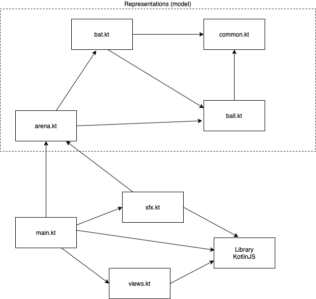

# Nullable types, enum types and singletons

## Script / Outline (65 mins) ([video](https://www.youtube.com/watch?v=nkbVjgpKPUY&list=PL8XxoCaL3dBiJ_djQKKbbI4uN081F7Sgw&index=20))
1. Goal: Levelling up our programming skills
2. Kotlin's type system, continued
   1. [Nullable types](https://kotlinlang.org/docs/reference/null-safety.html)
   2. [Enum types](https://kotlinlang.org/docs/reference/enum-classes.html)
   3. [Singletons](https://kotlinlang.org/docs/reference/object-declarations.html)
3. Demo: Using these new constructs in the Pong game 
   1. Playing sounds cannot mandate a dependency between the model and the `sfx.kt` module, [remember](16-basic-principles-design.md)?
   2. Bring our design back to sanity by removing those dependencies. 
   
   

## Exercises (_coming soon_)
