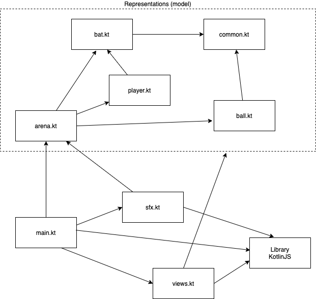

# Summary - coding Pong

## Script / Outline (30 mins) (_video coming soon_)
1. Our journey so far
   1. Representations (how to represent the problem domain entities)
      1. Kotlin's type system (a first look at it)
      2. Values: simple and composite
   2. Behaviour (how does our program behave)
      1. Expressions
      2. Functions and function composition (i.e. HOF)
2. Outcome: We have built a minimalistic [Pong](https://playpong.net/) variant
   1. Check it out [here](#summary---coding-pong)
   2. [Main design decisions]()   
3. Main takeaway: building software is mostly about __composition__
   1. Composition of data
   2. Composition of behaviour

### Dependencies of the final (alpha) version of Pong 

