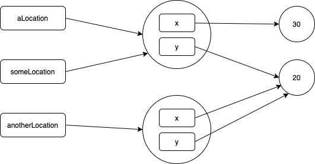

# Mutability and Immutability

## Exercises solutions

 1. Consider the following program:
    ```kotlin
    data class Location(var x: Int, var y: Int)

    fun main() {
        val aLocation = Location(20, 20)
        val anotherLocation = Location(20, 20)
        val someLocation = aLocation

        // (A)

        someLocation.x = someLocation.x + 10

        // (B)

        // ... other stuff not relevant to the question
    }
    ```
   1. Draw a diagram of the the program's state at the line marked with `// (A)`.
   
      __Answer:__   
      

   2. What is the value of each of the following expressions at line `// (A)`? 
      * `aLocation.x` --> `20`
      * `anotherLocation.x` --> `20`
      * `someLocation.x` --> `20`
      * `someLocation === aLocation` --> `true`
      * `someLocation === anotherLocation` --> `false`
   3. Draw another diagram of the the program's state, this time at the line marked with `// (B)`. Notice the differences between both diagrams.
   
      __Answer:__   
      

   4. What is the value of each of the following expressions at line `// (B)`?  
      * `aLocation.x` --> `30`
      * `anotherLocation.x` --> `20`
      * `someLocation.x` --> `30`
      * `someLocation === aLocation` --> `true`
      * `someLocation === anotherLocation` --> `false`
      
      **Sugestion**: Remember that `println(...)` can be used to display the value of an expression. Experiment with the playground and make sure that your *mental model*, expressed by the diagrams you draw are able to explain the results.
  
1. Consider the following program:    
    ```kotlin
    data class Location(var x: Int, var y: Int)
    data class Ball(val center: Location, val radius: Int)

    fun main() {
        val aLocation = Location(20, 20)
        val aBall = Ball(aLocation, 15)
        val anotherBall = Ball(aLocation, 15)

        // (A)
        
        aBall.center.x = aBall.center.x + 10

        // (B)

        aBall.center = Location(aBall.center.x + 10, aBall.center.y)

        // (C)

        // ... other stuff not relevant to the question   
    }
    ```    

    1. What is the value of each of the following expressions at each annotated line (e.g. at `// (A)`, `// (B)` and `// (C)`?

        __Answer:__   

        At line `// (A)`   
        
        * `aBall.center.x` --> `20`
        * `anotherBall.center.x`  --> `20`
      
        At line `// (B)`   

        * `aBall.center.x`  --> `30`
        * `anotherBall.center.x`  --> `30`

        At line `// (C)`   

        * `aBall.center.x` --> `40`
        * `anotherBall.center.x` --> `30`   

    
    2. How many instances of type `Location` are created during the program's execution? 

        __Answer:__   `2`

